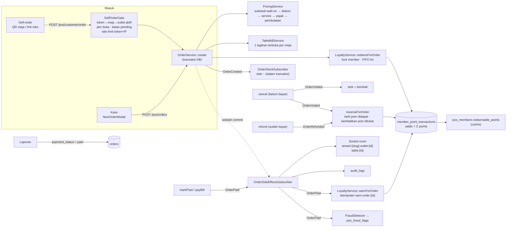

# Alur Order, Self-order & Poin Member (Fase 2B)

Satu mesin order untuk kasir dan self-order. Uang dihitung server, status dapur terpisah
dari pembayaran, poin dicatat di ledger, dan semua efek samping lewat event.
Temuan audit yang diperbaiki: [AUDIT_POS.md](AUDIT_POS.md).

## 1. Diagram alur data



Versi teks (untuk terminal):

```
QR / link toko ─► SelfOrderGate ─┐
Kasir ───────────────────────────┴─► OrderService::create ──► orders (status=new|accepted, unpaid)
                                        │  PricingService (server final)
                                        │  TableBillService (meja → tagihan terbuka)
                                        │  redeem poin (lock member, FIFO)
                                        │  OrderCreated → stok −
                                        ▼ setelah commit
                              socket tenant:{slug}:outlet:{id} + table:{id} · audit log

Dapur:  new → accepted → preparing → prepared → completed   (maju saja; lompat boleh)
        (belum bayar) → cancelled  ⇒ OrderVoided: stok +, poin dikembalikan/ditarik
Bayar:  unpaid → paid  ⇒ OrderPaid: poin masuk (sekali), fraud check     (status dapur tidak berubah)
        paid → refunded ⇒ OrderRefunded: poin ditarik/dikembalikan        (stok tidak kembali)
Laporan: payment_status = paid
```

## 2. Status

| Kode di DB | Kode baku | Label | Keterangan |
|---|---|---|---|
| `new` | `menunggu_konfirmasi` | Menunggu Konfirmasi | self-order saat outlet mewajibkan konfirmasi; order kasir baru |
| `accepted` | `dikonfirmasi` | Dikonfirmasi | self-order langsung ke sini bila konfirmasi dimatikan |
| `preparing` | `diproses` | Diproses | |
| `prepared` | `siap` | Siap | |
| `completed` | `selesai` | Selesai | final |
| `cancelled` | `dibatalkan` | Dibatalkan | final; hanya order **belum dibayar**, alasan wajib |

API menerima kode DB maupun kode baku (`PATCH /pos/orders/{id}/status {status:"dikonfirmasi"}`).
Transisi mundur atau dari status final ditolak `422 ILLEGAL_TRANSITION`. Respons memuat
`status_label` dan `allowed_next`. Pembayaran (`payment_status`: `unpaid → paid → refunded`)
**tidak** mengubah status dapur. Sumber: `App\Services\Pos\OrderStatus`.

## 3. Harga (sama untuk kasir & self-order)

```
subtotal   = Σ (harga produk + add-on terpilih) × qty          ← dari DB, bukan dari browser
net        = subtotal − diskon reward − diskon tukar poin        (min 0)
service    = round(net × service%)
pajak      = round((net + service) × pajak%)
final      = net + service + pajak, dibulatkan ke 0/100/500/1000 (setting outlet)
```

Disimpan di `orders`: `subtotal_amount`, `discount_amount`, `points_discount_amount`,
`service_amount`, `tax_amount`, `rounding_amount`, `final_amount` (`total_amount` = subtotal,
kompatibel lama). Angka dari frontend (`final_amount`, `discount_amount`) diabaikan.
Kasir memakai `POST /pos/orders/preview` untuk menampilkan total yang sama persis.
Self-order mengirim `expected_unit_price`; bila harga/stok/ketersediaan berubah, server
menjawab `409 CART_CHANGED` + `error.problems[]` (per item: `price` lama→baru, `stock`,
`unavailable`, `not_found`) dan halaman memperbarui keranjang.

Pengaturan per outlet (`outlets.settings`, UI: POS › Settings › Pesanan & Jam Buka):
`pricing{tax_percent, service_percent, rounding}`, `self_order{accept_orders,
require_confirmation, max_pending_per_table}`, `opening_hours{mon..sun:[{open,close}]}`
(kosong = selalu buka; slot lewat tengah malam boleh), `timezone`.

## 4. Self-order

- **QR** = `dining_tables.public_id`, 24 karakter acak, terikat ke `tenant_id` + `outlet_id`
  meja. `POST /pos/tables/{id}/regenerate-token` (owner/supervisor) → QR lama langsung mati.
  Cetak massal: POS › Tables › *Cetak semua QR* (`GET /pos/tables-qr-sheet`).
  `php artisan pos:report weak-tokens` mendaftar QR lama yang mudah ditebak.
- **Link toko** (`/customer/{org}`) memesan lewat meja semu `kind=counter` per outlet
  (tidak lagi memakai meja sungguhan; tidak masuk tagihan meja; `service_type=takeaway`).
- **Menu** hanya produk outlet itu; opsi/add-on aktif ikut dikirim; produk
  `hide_when_unavailable` yang habis disembunyikan; `outlet.status` berisi
  `can_order` + pesan ramah bila tutup/tidak menerima self-order (`423 OUTLET_CLOSED`).
- **Anti-spam**: limiter `hellom-self-order` (6/menit per token+IP, 30/menit per token,
  20/menit per IP) + maks. order `new` per meja (`429 TOO_MANY_PENDING`).
- **Member dari self-order**: isi nomor HP → ditautkan ke member yang ada; centang
  "daftarkan" → `MemberService::register` (jalur yang sama dengan kasir & halaman publik).
  Tukar poin tidak tersedia di self-order (butuh verifikasi di kasir).
- **Metode bayar** hanya yang aktif di outlet (`pos_payment_settings` outlet, lalu outlet
  utama); pembayaran sebenarnya tetap di kasir.

## 5. Tagihan meja

Setiap order ber-meja (kasir atau QR) masuk ke `table_bills` terbuka meja itu. Pelanggan
melihat semua order meja (`GET /pos/customer/table/{token}/orders`) dan bisa menambah
pesanan. Kasir: *Tagihan Meja* → *Bayar semua* (`POST /pos/table-bills/{id}/pay`) menandai
semua order belum bayar lunas dalam satu transaksi; tagihan tertutup otomatis saat semua
order lunas/dibatalkan. Split bill: fase berikutnya.

## 6. Member & poin

- Member milik **organisasi** (`pos_members.organization_id`); semua outlet melihat member
  yang sama. Identitas = `phone_normalized` (format `628…`): `08123…`, `628123…`,
  `+62 812-3…` adalah orang yang sama dalam satu organisasi, dan bisa orang lain di
  organisasi lain. Duplikat lama **tidak digabung otomatis**: `pos:report duplicates` /
  POS › Members › *Nomor ganda* → gabung manual oleh owner (audit log).
- **Ledger** `member_point_transactions` (`earn`, `redeem`, `adjust`, `expire`, `reversal`),
  `points` bertanda, `balance_after`, `remaining_points` (lot FIFO), `expires_at`,
  `idempotency_key` unik. Saldo = Σ `points`; `redeemable_points` hanya cache.
- Poin masuk **hanya** saat `OrderPaid` (sekali, kunci `earn:order:{id}`); ditarik saat
  void/refund (tidak pernah membuat saldo negatif; kekurangan dicatat di `metadata`).
- Tukar poin: saat membuat order kasir (`redeem_points`), member dikunci `FOR UPDATE`
  → dua kasir bersamaan tidak bisa membuat saldo negatif. Wajib ketik nama member
  (`NameConfirmationVerifier`); OTP WhatsApp tersedia sebagai kelas kosong
  `WhatsappOtpVerifier` (ganti binding di `AppServiceProvider`).
- Aturan per organisasi (POS › Loyalty): nilai 1 poin (Rp), minimal & maksimal tukar,
  masa berlaku (bulan). `pos:points expire` terjadwal 02:30 setiap hari.
- Ubah poin manual: owner/supervisor (staf role `admin`), alasan wajib, audit log.
- Sinyal kecurangan (tidak memblokir): member sama ≥3× oleh kasir yang sama dalam satu
  shift; nomor HP member = nomor HP staf. POS › Members › *Sinyal kecurangan*.

## 7. Realtime

| Room | Siapa | Token dari |
|---|---|---|
| `tenant:{slug}:outlet:{id}` | kasir/owner outlet itu | `GET /pos/realtime/token` (outlet aktif dari `InjectPosContext`) |
| `table:{id}` | tamu di meja itu | `GET /pos/customer/table/{token}/realtime-token` |

Event: `pos.order` dan `customer.order` `{event: order.created|confirmed|status_changed|paid|voided|refunded, order:{…}}`.
Kasir: bunyi + badge saat `order.created`; polling 15 detik bila socket putus (60 detik bila
tersambung). Tamu: polling 15 detik sebagai cadangan. Socket anonim tidak bisa lagi
`join` room apa pun (`realtime/server.js`).

## 8. Endpoint baru / berubah

| Method | Path | Catatan |
|---|---|---|
| POST | `/pos/orders/preview` | total server tanpa menyimpan |
| POST | `/pos/orders` | harga server; `redeem_points`, `confirm_member_name` |
| PATCH | `/pos/orders/{id}/status` | transisi sah saja; `reason` wajib untuk batal |
| POST | `/pos/orders/{id}/payment` | tidak lagi men-set `completed` |
| POST | `/pos/orders/{id}/cancel` · `/refund` | refund: owner/supervisor |
| GET/POST | `/pos/table-bills`, `/pos/table-bills/{id}`, `/pos/table-bills/{id}/pay` | |
| GET | `/pos/realtime/token` | room outlet |
| GET/PUT | `/pos/outlet-settings` | PUT: owner/admin |
| POST | `/pos/tables/{id}/regenerate-token` · GET `/pos/tables-qr-sheet` | |
| GET | `/pos/members?q=&outlet_id=&sort=` | sort: `recent`, `most_active`, `top_spend`, `points`, `name` |
| GET | `/pos/members/export` · `/duplicates` · `/fraud-flags` | export & gabung: owner |
| POST | `/pos/members/merge` · `/pos/members/{id}/adjust-points` | |
| GET | `/pos/members/{id}/points` · `/orders` | ledger & riwayat pesanan |
| GET | `/pos/customer/table/{token}/orders` · `/realtime-token` | publik, rate limited |

Kode error baru (`error.code`): `CART_CHANGED` (409), `OUTLET_CLOSED` (423),
`TOO_MANY_PENDING` (429), `ILLEGAL_TRANSITION`, `ORDER_ALREADY_PAID`, `ORDER_NOT_PAID`,
`POINTS_INSUFFICIENT`, `POINTS_BELOW_MIN`, `POINTS_ABOVE_MAX`, `POINTS_ABOVE_TOTAL`,
`MEMBER_NAME_MISMATCH`, `REWARD_NOT_ELIGIBLE`, `MEMBER_EXISTS`, `BILL_CLOSED`.

## 9. Migrasi data & verifikasi

Migration: `2026_09_29_000001_pos_order_foundation` (kolom harga/status order,
`order_number_sequences`, `table_bills`, meja `kind`/`token_rotated_at`/`outlet_id`, kode meja
unik per tenant) dan `2026_09_29_000002_pos_member_ledger` (`organization_id` +
`phone_normalized` member, ledger dengan baris **saldo awal** per member, kolom aturan tukar
poin, `pos_fraud_flags`). Tidak ada data yang dihapus; duplikat dan data yatim hanya dilaporkan.

### PowerShell (Laragon, Windows)

```powershell
cd C:\laragon\app\SelfOrderResto\backend

# 0) Backup dulu (ganti <DB> dengan nama database)
mysqldump -u root <DB> > "..\backup-sebelum-fase2b-$(Get-Date -Format yyyyMMdd-HHmm).sql"

# 1) Catat saldo poin SEBELUM migrasi (simpan hasilnya)
mysql -u root <DB> -e "SELECT COUNT(*) members, SUM(redeemable_points) saldo FROM pos_members;"

# 2) Migrasi + cache
Remove-Item bootstrap\cache\config.php -ErrorAction SilentlyContinue
php artisan migrate
php artisan config:cache; php artisan route:cache

# 3) Cek hasil (read-only)
php artisan pos:points reconcile          # cache = ledger untuk semua member
php artisan pos:report duplicates         # nomor HP ganda → gabung manual di POS
php artisan pos:report orphans            # order/meja/member tanpa outlet/organisasi
php artisan pos:report weak-tokens        # QR lama → "Ganti QR" lalu cetak ulang

# 4) Realtime: server.js berubah → restart
pm2 restart hellom-realtime               # lokal: hentikan lalu `node server.js`

# 5) Frontend
cd ..\frontend; npx tsc --noEmit; npm run build
```

### SQL verifikasi (saldo sebelum = sesudah)

```sql
-- Saldo sesudah migrasi: harus sama dengan angka langkah 1
SELECT COUNT(*) AS members, SUM(redeemable_points) AS saldo_cache FROM pos_members;
SELECT SUM(points) AS saldo_ledger FROM member_point_transactions;

-- Harus 0 baris: member yang cache-nya beda dengan ledger
SELECT m.id, m.name, m.redeemable_points AS cache, COALESCE(SUM(t.points), 0) AS ledger
FROM pos_members m
LEFT JOIN member_point_transactions t ON t.member_id = m.id
GROUP BY m.id, m.name, m.redeemable_points
HAVING cache <> ledger;

-- Baris saldo awal per member (satu per member bersaldo)
SELECT COUNT(*) FROM member_point_transactions WHERE idempotency_key LIKE 'opening:member:%';

-- Member tanpa organisasi / nomor belum dinormalisasi (harus 0)
SELECT COUNT(*) FROM pos_members WHERE organization_id IS NULL;
SELECT COUNT(*) FROM pos_members WHERE phone IS NOT NULL AND phone <> '' AND phone_normalized IS NULL;

-- Nomor HP ganda dalam satu organisasi (dilaporkan, tidak digabung)
SELECT organization_id, phone_normalized, COUNT(*) n, GROUP_CONCAT(id) ids
FROM pos_members WHERE merged_into_id IS NULL AND phone_normalized IS NOT NULL
GROUP BY organization_id, phone_normalized HAVING n > 1;

-- Data yatim (outlet default tidak bisa ditentukan dari slug)
SELECT tenant_id, COUNT(*) FROM orders WHERE outlet_id IS NULL AND deleted_at IS NULL GROUP BY tenant_id;
SELECT tenant_id, COUNT(*) FROM dining_tables WHERE outlet_id IS NULL GROUP BY tenant_id;

-- Poin hanya dari order lunas (harus 0)
SELECT COUNT(*) FROM member_point_transactions t JOIN orders o ON o.id = t.order_id
WHERE t.type = 'earn' AND o.payment_status = 'unpaid';
```

## 10. Tes

Tes POS berjalan di MySQL `hellom_pos_test` (migration memakai SQL khusus MySQL):

```powershell
cd C:\laragon\app\SelfOrderResto\backend
# sekali saja: salin STRUKTUR database dev (tanpa data) ke hellom_pos_test
mysql -u root -e "CREATE DATABASE IF NOT EXISTS hellom_pos_test"
cmd /c "mysqldump -u root --no-data <DB> | mysql -u root hellom_pos_test"

Remove-Item bootstrap\cache\config.php -ErrorAction SilentlyContinue
php vendor\bin\phpunit -c phpunit.pos.xml
```

| Tes | Membuktikan |
|---|---|
| `SelfOrderIsolationTest` | QR outlet A tidak bisa memesan produk outlet B / tenant lain; meja outlet B ditolak di outlet A; QR yang diganti mati; jam tutup & batas pending; perubahan harga dilaporkan |
| `PricingParityTest` | total self-order = total kasir untuk keranjang yang sama (add-on, service 5%, pajak 11%, pembulatan 100) |
| `MemberPhoneTest` | `08…`/`628…`/`+62…` satu member dalam tenant, beda member di tenant lain; daftar dari self-order = dari kasir |
| `PointsLifecycleTest` | tidak ada poin sebelum lunas; bayar dua kali ditolak; refund menarik poin; batal mengembalikan poin tukar & stok; transisi ilegal ditolak; tagihan meja gabungan |
| `ConcurrentRedeemTest` | dua proses PHP menukar poin bersamaan → tepat satu berhasil, saldo tidak negatif |
| `CashierApiTest` | endpoint kasir end-to-end: kasir terkunci di outletnya, total server, bayar ≠ selesai, refund/ubah poin hanya supervisor |
